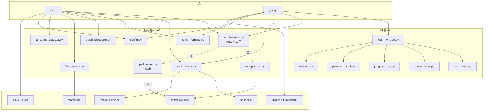

> 📂 **路径**: `docs/PROJECT_STRUCTURE.md`
> 🎯 **目的**: 描述 VoiceScribe v0.1.0 代码仓库的目录与文件布局

---

# 🗂️ VoiceScribe · 项目目录结构

> 完整的代码仓库布局说明。每个目录、关键文件的职责一目了然。

---

## 一、目录树总览

```text
MyWisper-PaddleSpeech/
├── voicescribe/              # 主包（产品名 VoiceScribe）
│   ├── __init__.py
│   ├── __version__.py
│   ├── cli.py                # Click 命令行入口
│   ├── gui.py                # Tkinter GUI 入口
│   ├── core/                 # 核心业务模块
│   │   ├── __init__.py
│   │   ├── asr_backend.py    # ASR 后端抽象基类 + 工厂
│   │   ├── audio_loader.py   # 音频加载（WAV/FLAC/OGG/MP3/M4A）
│   │   ├── batch_processor.py# 批量处理（递归扫描）
│   │   ├── config.py         # 配置 dataclass
│   │   ├── file_watcher.py   # watchdog 文件监听
│   │   ├── language_detector.py# 文件名启发式语言识别
│   │   ├── output_formats.py # TXT/MD/SRT/VTT 格式化
│   │   ├── paddle_asr.py     # PaddleSpeech 后端（Python 3.14 stub）
│   │   └── whisper_asr.py    # faster-whisper 后端
│   └── ui/                   # GUI 子组件
│       ├── __init__.py
│       ├── drop_zone.py      # 拖放区
│       ├── main_window.py    # 主窗口装配
│       ├── preview_panel.py  # 字幕预览面板
│       ├── progress_bar.py   # 进度条
│       ├── queue_panel.py    # 任务队列
│       └── widgets.py        # 自定义小部件
│
├── tests/                    # 单元测试（pytest）
│   ├── __init__.py
│   ├── conftest.py
│   ├── test_asr_backend.py
│   ├── test_audio_loader.py
│   ├── test_batch_processor.py
│   ├── test_cli.py
│   ├── test_language_detector.py
│   ├── test_output_formats.py
│   └── test_whisper_asr.py
│
├── scripts/                  # 运维脚本
│   ├── build_cli.bat         # PyInstaller 打包 CLI
│   ├── build_gui.bat         # PyInstaller 打包 GUI
│   └── download_models.py    # 预下载 Whisper 模型
│
├── docs/                     # 文档
│   ├── PROJECT_STRUCTURE.md  # 本文件
│   ├── 01_侧面检测报告.md
│   ├── 02_NPU加速方案.md
│   └── superpowers/
│       ├── specs/
│       │   └── 2026-07-04-voicescribe-implementation-design.md
│       └── plans/
│           └── 2026-07-04-voicescribe-v1.md
│
├── output/                   # 转写输出目录（运行时生成）
│   ├── 20260617_160514.txt
│   ├── 20260617_160514.srt
│   └── transcribe.log
│
├── .superpowers/sdd/         # SDD 过程产物（git-ignored）
│   ├── progress.md           # 任务进度台账
│   ├── task-*-brief.md       # 任务需求
│   ├── task-*-report.md      # 任务报告
│   └── review-*.diff         # 评审差异
│
├── .claude/                  # Claude Code 本地配置
│
├── voicescribe.egg-info/     # pip install -e . 生成
│
├── pyproject.toml            # 项目元信息 + 依赖 + 入口脚本
├── README.md                 # 项目主页
├── CHANGELOG.md              # 版本变更日志
├── LICENSE                   # MIT 许可证
└── .gitignore                # Git 忽略规则
```

---

## 二、顶层目录作用

| 目录/文件 | 作用 | 是否入仓 |
|------|------|:---:|
| `voicescribe/` | 产品代码主包（顶层包名沿用 `MyWisper-PaddleSpeech`） | ✅ |
| `tests/` | pytest 单元测试，53+ 用例覆盖核心模块 | ✅ |
| `scripts/` | 打包脚本 + 模型预下载脚本 | ✅ |
| `docs/` | 设计文档、实施计划、检测报告 | ✅ |
| `output/` | 运行时生成的转写结果（不入仓） | ❌ |
| `.superpowers/sdd/` | SDD 工作流产物：任务简报、报告、评审 diff | ❌ |
| `.claude/` | Claude Code 本地 hook 与状态 | ❌ |
| `voicescribe.egg-info/` | `pip install -e .` 生成的元数据 | ❌ |

---

## 三、`voicescribe/core/` 核心模块

| 文件 | 职责 | 关键 API |
|------|------|---------|
| `asr_backend.py` | ASR 抽象基类（ABC）+ 工厂函数 | `ASRBackend`, `Segment`, `get_asr_backend(lang)` |
| `whisper_asr.py` | faster-whisper 后端实现（ja/en） | `WhisperASR(config)` |
| `paddle_asr.py` | PaddleSpeech 后端（zh，Python 3.14 仅 stub） | `PaddleASR(config)` |
| `audio_loader.py` | 加载 WAV/FLAC/OGG/MP3/M4A → (sr, np.ndarray) | `load_audio()`, `get_duration()` |
| `output_formats.py` | 格式化输出 TXT/MD/SRT/VTT | `FORMATTERS` dict |
| `batch_processor.py` | 递归扫描目录、批量并行处理 | `process_batch()` |
| `file_watcher.py` | watchdog 监听目录，新文件自动转写 | `FileWatcher`, `AudioFileHandler` |
| `language_detector.py` | 文件名启发式语言检测（`_zh`/`_jp`/`_en`） | `detect_language()` |
| `config.py` | 全局配置 dataclass | `Config` |

---

## 四、`voicescribe/ui/` GUI 组件

| 文件 | 职责 |
|------|------|
| `main_window.py` | 主窗口装配（菜单 + 工具栏 + 面板） |
| `drop_zone.py` | 拖放区（依赖 tkinterdnd2，缺失时降级） |
| `queue_panel.py` | 任务队列（带滚动条，显示待处理/已完成） |
| `progress_bar.py` | 进度条（ttk.Progressbar 包装） |
| `preview_panel.py` | 字幕预览（实时显示转写片段） |
| `widgets.py` | 自定义小部件（按钮、标签等） |

---

## 五、`tests/` 测试覆盖

| 测试文件 | 覆盖模块 | 用例数 |
|----------|---------|:---:|
| `test_audio_loader.py` | `audio_loader.py` | 9 |
| `test_asr_backend.py` | `asr_backend.py` 抽象 + 工厂 | 4 |
| `test_whisper_asr.py` | `whisper_asr.py` 懒加载 + 模型就绪检查 | 6 |
| `test_output_formats.py` | `output_formats.py` 四种格式 | 4 |
| `test_language_detector.py` | `language_detector.py` | 4 |
| `test_batch_processor.py` | `batch_processor.py` | 8 |
| `test_cli.py` | `cli.py` 命令行 | 18 |
| **合计** | — | **53** |

---

## 六、入口脚本

| 命令 | 入口点 | 模式 |
|------|--------|------|
| `voicescribe` | `voicescribe.cli:main` | CLI |
| `voicescribe-gui` | `voicescribe.gui:main` | GUI |

定义在 `pyproject.toml` 的 `[project.scripts]`。

---

## 七、模块依赖关系



---

## 八、`.superpowers/sdd/` SDD 产物

| 文件 | 用途 |
|------|------|
| `progress.md` | 9 任务实施进度台账 |
| `task-N-brief.md` | 任务 N 的需求简报（输入） |
| `task-N-report.md` | 任务 N 的实现报告（输出） |
| `review-*.diff` | 任务评审的 git 差异快照 |

这些是 **过程产物**，不进版本库（`.superpowers/sdd/.gitignore` 标记）。

---

## 九、扩展点

| 想加什么 | 改哪里 |
|---------|--------|
| 新 ASR 后端（如 Vosk） | 新建 `core/vosk_asr.py` + 注册到 `asr_backend.py` 工厂 |
| 新输出格式（如 JSON） | 在 `core/output_formats.py` 添加 `JsonFormatter` |
| 新 GUI 面板 | `ui/` 新增组件 + `main_window.py` 装配 |
| 新 CLI 子命令 | `cli.py` 增加 `@cli.command()` |
| 新打包目标（Linux/macOS） | `scripts/` 增加 `.sh` 脚本 |

---

*📂 VoiceScribe 项目结构 v0.1.0 · MiuMiu 🐾 · 2026-07-04*